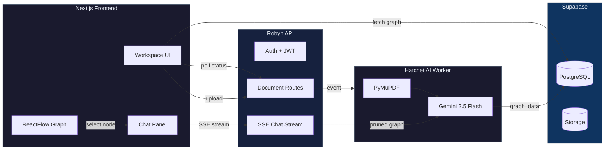

# OmniVault

> Multimodal document intelligence — upload a PDF, get an interactive knowledge graph and an AI research assistant powered by RAG over structured graph data.


---

## What It Does

OmniVault transforms unstructured PDFs into **interactive knowledge graphs** and lets you query them conversationally. Upload a document, wait a moment, and explore its structure as a navigable graph — then chat with an AI assistant that reasons over the graph's topology, not just keyword matches.

**Why it matters:** Traditional RAG systems chunk documents and lose structural relationships. OmniVault preserves hierarchy (sections → subsections → details), generates a structured graph via Gemini, and streams conversational responses — so the AI can answer "How does Section 3 connect to Section 1?" instead of vague similarity-search results.

**How it works:** PDFs are processed by a Hatchet-powered async worker that extracts text via PyMuPDF, generates a hierarchical knowledge graph via Gemini 2.5 Flash, and stores the result in Supabase. The frontend renders the graph with ReactFlow + Dagre layout, and the chat endpoint streams SSE responses using the graph as context — with smart pruning to stay within token limits.

---

## Features

- **PDF Upload & Async Processing** — Upload any PDF; a Hatchet-powered worker handles extraction, graph generation, and status updates in the background
- **Structured Knowledge Graphs** — Hierarchical node/edge graph (level 0–3) rendered with ReactFlow + Dagre auto-layout
- **AI Chat over Graphs** — RAG-style conversational querying via Google Gemini with SSE streaming; graph context is pruned based on the selected node
- **Tiered AI Intelligence** — Documents are auto-classified (TINY/SMALL/MEDIUM/LARGE) and prompt complexity is scaled accordingly
- **Node-focused Queries** — Click a graph node to focus your question on that specific section
- **User-owned Gemini Keys** — Users provide their own API key; no vendor lock-in or centralized billing
- **Supabase Auth** — Email/password auth via Supabase with JWT-backed session management
- **Polyglot Monorepo** — Robyn (Python) + Next.js 14 + Hatchet worker in one repo, managed by `uv` + `pnpm`

---

## Tech Stack

| Layer | Technology |
|-------|------------|
| Frontend | Next.js 14 App Router, React, Tailwind CSS, Zustand, ReactFlow, Dagre |
| Backend API | Robyn (Python async web framework), PyJWT, bcrypt |
| AI Worker | Hatchet, PyMuPDF, Google Gemini (`google-genai`) |
| Database & Auth | Supabase (PostgreSQL + Auth + Storage) |
| Job Queue | Hatchet + Redis |
| Package Managers | `pnpm` (JS), `uv` (Python) |
| Git Hooks | Lefthook (Ruff + ESLint) |

---

## Quick Start

### Prerequisites

- Docker & Docker Compose
- [pnpm](https://pnpm.io/installation)
- [uv](https://github.com/astral-sh/uv)
- [Supabase](https://supabase.com) project (free tier works)

### 1. Clone & Install

```bash
git clone https://github.com/<your-org>/OmniVault.git
cd OmniVault
```

### 2. Start Infrastructure

```bash
docker compose up -d    # EdgeDB + Redis
```

### 3. Configure Supabase

1. Create a Supabase project
2. Run `schema.sql` in the Supabase SQL Editor
3. Enable **Email Auth** and create a **documents** storage bucket (public)

### 4. Set Environment Variables

**`apps/api-core/.env`**
```env
SUPABASE_URL=https://your-project.supabase.co
SUPABASE_KEY=your-anon-key
SUPABASE_SERVICE_KEY=your-service-key
SUPABASE_ANON_KEY=your-anon-key
SUPABASE_JWT_SECRET=your-jwt-secret
HOST=0.0.0.0
PORT=8080
```

**`apps/worker-ai/.env`**
```env
SUPABASE_URL=https://your-project.supabase.co
SUPABASE_KEY=your-anon-key
HATCHET_CLIENT_TOKEN=your-hatchet-token
```

**`apps/web/.env.local`**
```env
NEXT_PUBLIC_BACKEND_URL=http://localhost:8080
```

### 5. Install & Run

```bash
# Frontend
cd apps/web && pnpm install && pnpm dev

# API (separate terminal)
cd apps/api-core && uv sync && uv run python -m api_core.main

# AI Worker (separate terminal)
cd apps/worker-ai && uv sync && uv run python -m worker_ai.main
```

Open [http://localhost:3000](http://localhost:3000) — register an account, add your Gemini API key in Settings, and upload your first PDF.

---

## Architecture

OmniVault follows a **three-tier event-driven architecture**:



For the full system component diagram, sequence diagrams, and data flow, see [docs/architecture.md](docs/architecture.md).

---

## Documentation Hub

| Document | Description |
|----------|-------------|
| [Architecture](docs/architecture.md) | System overview, component diagrams, directory structure, key abstractions |
| [API Reference](docs/api-reference.md) | All REST endpoints, request/response shapes, database schema |
| [Contributing Guide](CONTRIBUTING.md) | Local setup, code conventions, git workflow, architecture notes |

---

## Project Status

See [status.md](./status.md) for the current product roadmap and milestone tracking.

**Phase 1 (MVP & Stability)** is complete — Supabase auth, vectorless RAG, tiered processing, rich graph extraction, and chat UX are all working.

**Phase 2 (Scale & UX)** is next — Redis caching, PDF viewer, inter-document graphs, and WebSocket updates.
