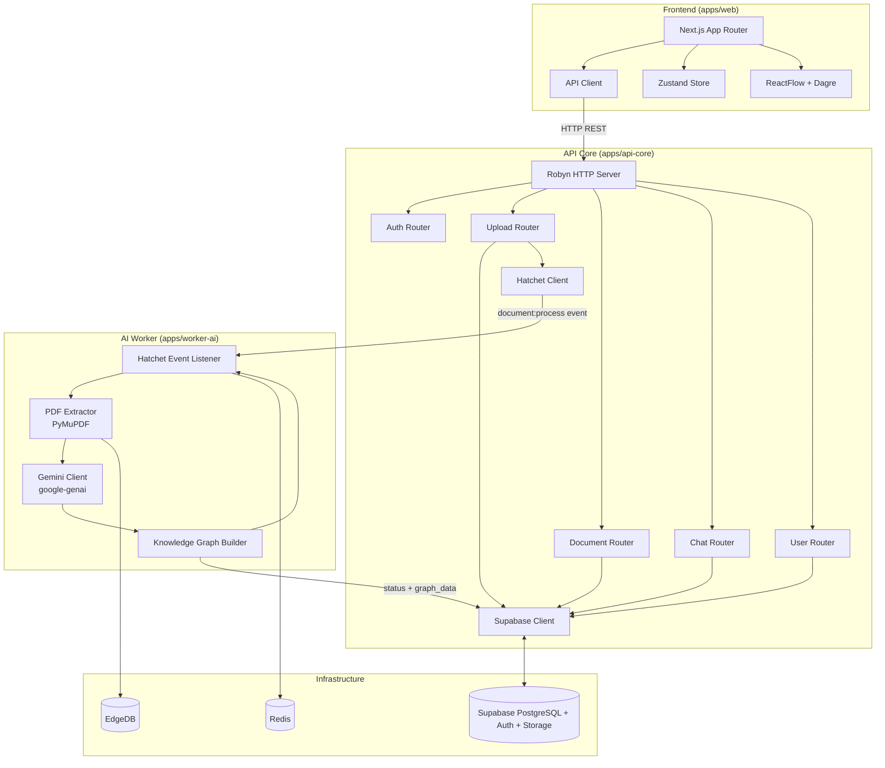
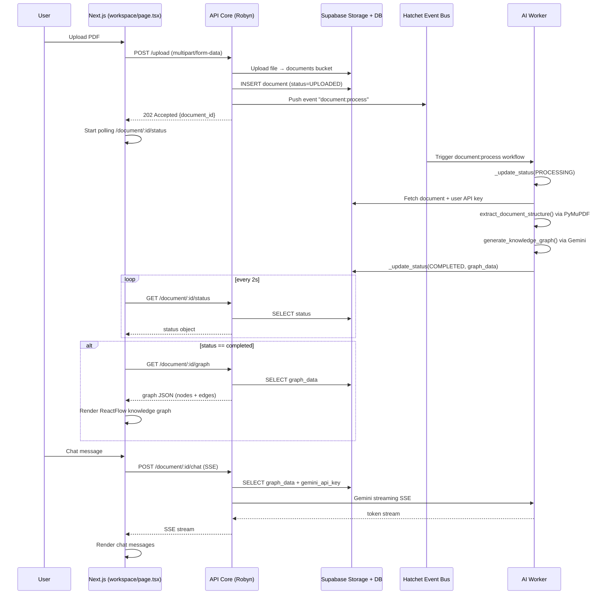

# OmniVault Architecture

## System Overview

OmniVault is a **polyglot monorepo** SaaS platform for multimodal document intelligence. It transforms unstructured PDFs into interactive knowledge graphs and enables conversational querying via RAG over graph data.

### Architectural Pattern

- **Backend**: Async Python API using [Robyn](https://github.com/sparckles/robyn) (event-driven web framework)
- **Frontend**: Next.js 14 App Router with React and Tailwind CSS
- **AI Worker**: Hatchet-powered async worker for CPU/GPU-intensive document processing and LLM calls
- **Database Layer**: Supabase (PostgreSQL + Auth + Storage) + Redis for job queues
- **State Management**: Zustand (frontend), in-memory polling (frontend↔backend sync)

---

## System Component Diagram



---

## Document Processing Flow



---

## Authentication Flow

```mermaid
flowchart LR
    A[User registers<br/>/login] --> B[Supabase Auth]
    B --> C[access_token JWT]
    C --> D[Cookie<br/>omnivault_token]
    D --> E[decode_token()<br/>in all protected routes]
    E --> F{Valid?}
    F -->|Yes| G[Request proceeds]
    F -->|No| H[401 Unauthorized]
```

- `decode_token()` in `apps/api-core/src/api_core/auth_utils.py` extracts the `Authorization: Bearer <token>` header and verifies it against Supabase Auth.
- The token is mirrored into a browser cookie (`omnivault_token`) after login so the Next.js frontend can forward it as a Bearer header.

---

## Directory Structure

```
OmniVault/
├── apps/
│   ├── api-core/                    # Robyn Python API server
│   │   ├── pyproject.toml
│   │   └── src/api_core/
│   │       ├── main.py              # Entry point, router registration
│   │       ├── auth_utils.py        # JWT decode helper
│   │       ├── db.py               # Supabase client singleton
│   │       └── routes/
│   │           ├── auth.py          # /register, /login
│   │           ├── upload.py       # /upload → Hatchet trigger
│   │           ├── document.py     # /document/:id/*, /documents
│   │           ├── chat.py         # /document/:id/chat (SSE RAG)
│   │           └── user.py         # /user/api-key
│   │
│   ├── web/                         # Next.js 14 frontend
│   │   ├── package.json
│   │   └── src/
│   │       ├── middleware.ts       # Route protection
│   │       ├── store/
│   │       │   └── useStore.ts      # Zustand state
│   │       ├── app/
│   │       │   ├── layout.tsx
│   │       │   ├── page.tsx         # Root redirect
│   │       │   ├── (auth)/
│   │       │   │   ├── login/
│   │       │   │   └── register/
│   │       │   └── workspace/
│   │       │       └── page.tsx     # Main dashboard
│   │       └── components/
│   │           ├── LoginForm.tsx
│   │           ├── RegisterForm.tsx
│   │           ├── ApiKeyModal.tsx
│   │           ├── KnowledgeGraph.tsx  # ReactFlow + Dagre
│   │           └── ChatPanel.tsx        # SSE chat
│   │
│   └── worker-ai/                   # Hatchet async AI worker
│       ├── pyproject.toml
│       └── src/worker_ai/
│           ├── main.py             # Workflow registration
│           └── rag.py             # PDF extraction + Gemini graph gen
│
├── packages/                        # (reserved for shared packages)
│
├── graphify-out/                   # AI-generated knowledge graph
│
├── schema.sql                      # Supabase PostgreSQL schema
├── pyproject.toml                  # Python workspace root (uv)
├── pnpm-workspace.yaml            # JS workspace root (pnpm)
├── package.json                    # Root (lefthook only)
├── docker-compose.yml             # Redis + EdgeDB for local dev
├── Dockerfile
└── README.md
```

---

## Key Abstractions

### `decode_token()` — Cross-cutting Auth Guard
Centralises JWT extraction across all protected routes. Any route handler that calls `decode_token()` before accessing user-specific data enforces authentication without repeating boilerplate.

### Hatchet Event Bus (`document:process`)
Decouples the upload HTTP response from heavy AI work. The API returns immediately (202 Accepted); the worker picks up the job asynchronously and updates the document status in Supabase when complete.

### Graph Pruning (`_prune_graph`)
The chat route in `apps/api-core/src/api_core/routes/chat.py` reduces the graph payload before sending to Gemini:
- **Node selected**: Returns ego-subgraph (1-hop neighbors only)
- **Large graph (>1000 nodes)**: Returns only root-level nodes
- **Small graph**: Sends full graph

### Tiered Gemini Prompts (`generate_knowledge_graph`)
Document complexity is auto-detected and prompts are adjusted:

| Tier | Pages | Prompt Adjustment |
|------|-------|-------------------|
| TINY | <50 | Full content preserved |
| SMALL | 50–199 | Content summary |
| MEDIUM | 200–999 | Content summary, truncated input |
| LARGE | ≥1000 | Root nodes only, heavy truncation |
