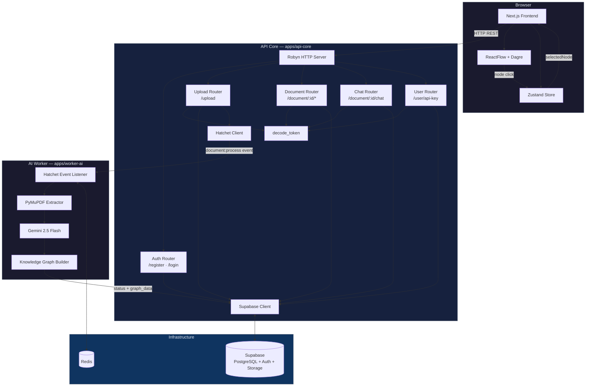
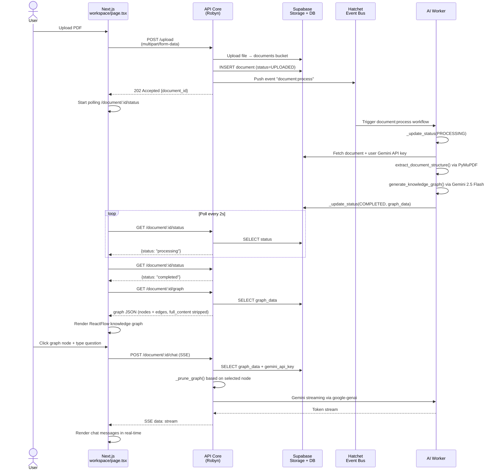
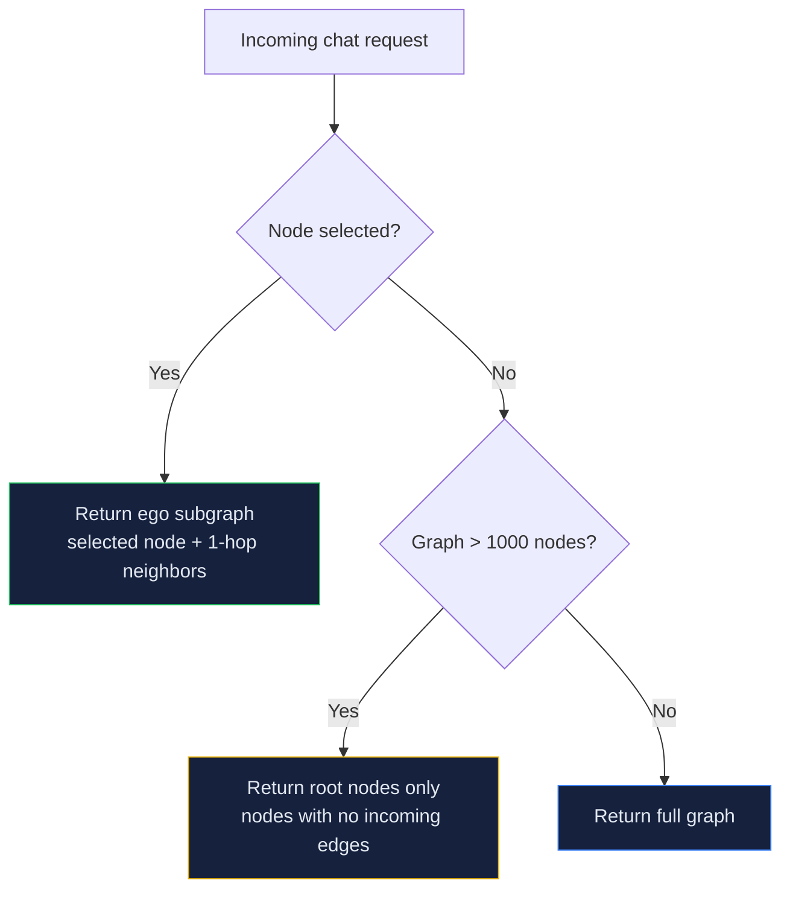

# OmniVault Architecture

## System Overview

OmniVault is a **polyglot monorepo** SaaS platform for multimodal document intelligence. It transforms unstructured PDFs into interactive knowledge graphs and enables conversational querying via RAG over graph data — no vector embeddings required.

### Architectural Pattern

The system follows a **three-tier event-driven architecture**:

- **Frontend**: Next.js 14 App Router with React, Tailwind CSS, and Zustand for state management
- **Backend API**: Robyn (Python async web framework) handling auth, document management, and chat
- **AI Worker**: Hatchet-powered async worker for PDF extraction and Gemini-powered graph generation
- **Database Layer**: Supabase (PostgreSQL + Auth + Storage) for persistence; Redis for job queuing

---

## System Component Diagram



---

## Document Processing Flow



---

## Authentication Flow

```mermaid
flowchart LR
    A[User<br/>registers/logs in] --> B[Supabase Auth]
    B --> C[JWT access_token]
    C --> D[Cookie<br/>omnivault_token]
    D --> E[decode_token()<br/>in protected routes]
    E --> F{Valid?}
    F -->|Yes| G[Request proceeds]
    F -->|No| H[401 Unauthorized]

    style A fill:#1a1a2e,stroke:#475569,color:#e2e8f0
    style F fill:#16213e,stroke:#475569,color:#e2e8f0
```

- `decode_token()` in `auth_utils.py` extracts the `Authorization: Bearer <token>` header and decodes the JWT
- The token is stored as a browser cookie (`omnivault_token`) after login so the Next.js frontend can forward it as a Bearer header
- Next.js middleware (`middleware.ts`) redirects unauthenticated users away from `/workspace` to `/login`

---

## Graph Pruning Strategy

The chat endpoint reduces the graph payload before sending to Gemini to stay within context limits:



---

## Tiered AI Intelligence

Documents are auto-classified by page count. The Gemini prompt adjusts complexity accordingly:

| Tier | Pages | Strategy |
|------|-------|----------|
| TINY | <50 | Full content preserved in nodes |
| SMALL | 50-199 | Content summaries generated |
| MEDIUM | 200-999 | Summaries + truncated input |
| LARGE | 1000+ | Root nodes only, heavy truncation |

---

## Directory Structure

```
OmniVault/
├── apps/
│   ├── api-core/                    # Robyn Python API server
│   │   ├── pyproject.toml           # Dependencies: robyn, PyJWT, supabase, hatchet-sdk
│   │   └── src/api_core/
│   │       ├── main.py              # Entry point, CORS, router registration
│   │       ├── auth_utils.py        # JWT decode helper (decode_token)
│   │       ├── db.py                # Supabase client singletons (anon + service role)
│   │       └── routes/
│   │           ├── auth.py          # POST /register, /login
│   │           ├── upload.py        # POST /upload → triggers Hatchet worker
│   │           ├── document.py      # GET /documents, /document/:id/status, /document/:id/graph
│   │           ├── chat.py          # POST /document/:id/chat (SSE streaming RAG)
│   │           └── user.py          # POST /user/api-key
│   │
│   ├── web/                         # Next.js 14 frontend
│   │   ├── package.json             # Dependencies: react, @xyflow/react, dagre, zustand, lucide-react
│   │   └── src/
│   │       ├── middleware.ts        # Route protection (cookie-based auth guard)
│   │       ├── store/
│   │       │   └── useStore.ts      # Zustand global state (document, selectedNode, chat)
│   │       ├── app/
│   │       │   ├── layout.tsx       # Root layout with dark theme
│   │       │   ├── page.tsx         # Redirects to /workspace
│   │       │   ├── (auth)/
│   │       │   │   ├── login/page.tsx
│   │       │   │   └── register/page.tsx
│   │       │   └── workspace/
│   │       │       └── page.tsx     # Main dashboard (upload, graph, chat)
│   │       └── components/
│   │           ├── LoginForm.tsx     # Email/password login form
│   │           ├── RegisterForm.tsx  # Registration form
│   │           ├── ApiKeyModal.tsx   # Gemini API key configuration
│   │           ├── KnowledgeGraph.tsx # ReactFlow + Dagre auto-layout
│   │           └── ChatPanel.tsx     # SSE streaming chat with node context
│   │
│   └── worker-ai/                   # Hatchet async AI worker
│       ├── pyproject.toml           # Dependencies: hatchet-sdk, google-genai, pymupdf
│       └── src/worker_ai/
│           ├── main.py              # Hatchet workflow registration + document processing
│           └── rag.py               # PDF extraction + Gemini knowledge graph generation
│
├── schema.sql                       # PostgreSQL schema (users + documents tables)
├── pyproject.toml                   # Python workspace root (uv)
├── pnpm-workspace.yaml             # JS workspace root (pnpm)
├── package.json                     # Root devDependencies (lefthook)
├── docker-compose.yml              # Local dev services (EdgeDB, Redis)
├── Dockerfile
├── lefthook.yml                     # Git hooks (Ruff + ESLint)
├── start.sh                         # Startup script
├── status.md                        # Product roadmap & status
├── docs/
│   ├── architecture.md              # This file
│   └── api-reference.md             # REST API documentation
├── CONTRIBUTING.md                  # Developer onboarding guide
├── CODE_OF_CONDUCT.md               # Contributor Covenant
└── README.md                        # Project landing page
```

---

## Key Abstractions

### `decode_token()` — Cross-cutting Auth Guard

Centralises JWT extraction across all protected routes. Any route handler that calls `decode_token()` before accessing user-specific data enforces authentication without repeating boilerplate. Returns the user's UUID on success, `None` on failure.

### Hatchet Event Bus (`document:process`)

Decouples the upload HTTP response from heavy AI work. The API returns immediately (202 Accepted); the Hatchet worker picks up the job asynchronously and updates the document status in Supabase when complete. This prevents request timeouts on large documents.

### Graph Pruning (`_prune_graph`)

The chat route reduces the graph payload before sending to Gemini:
- **Node selected**: Returns ego-subgraph (1-hop neighbors only)
- **Large graph (>1000 nodes)**: Returns only root-level nodes
- **Small graph**: Sends full graph

### Tiered Gemini Prompts (`generate_knowledge_graph`)

Document complexity is auto-detected by page count. Smaller documents get richer extraction (full content preserved); larger documents get summarised to stay within Gemini's context window.

### User-owned API Keys

Users provide their own Google Gemini API key via the Settings modal. The key is stored in the `users` table and fetched via a joined query when processing documents or chat. This eliminates centralized billing and vendor lock-in.
